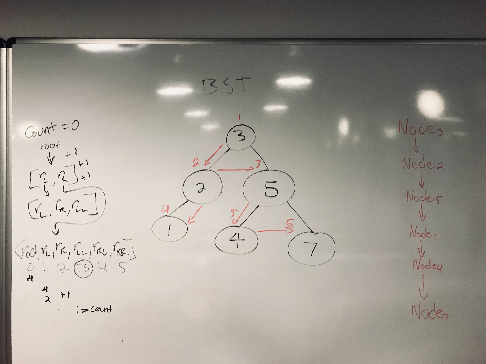
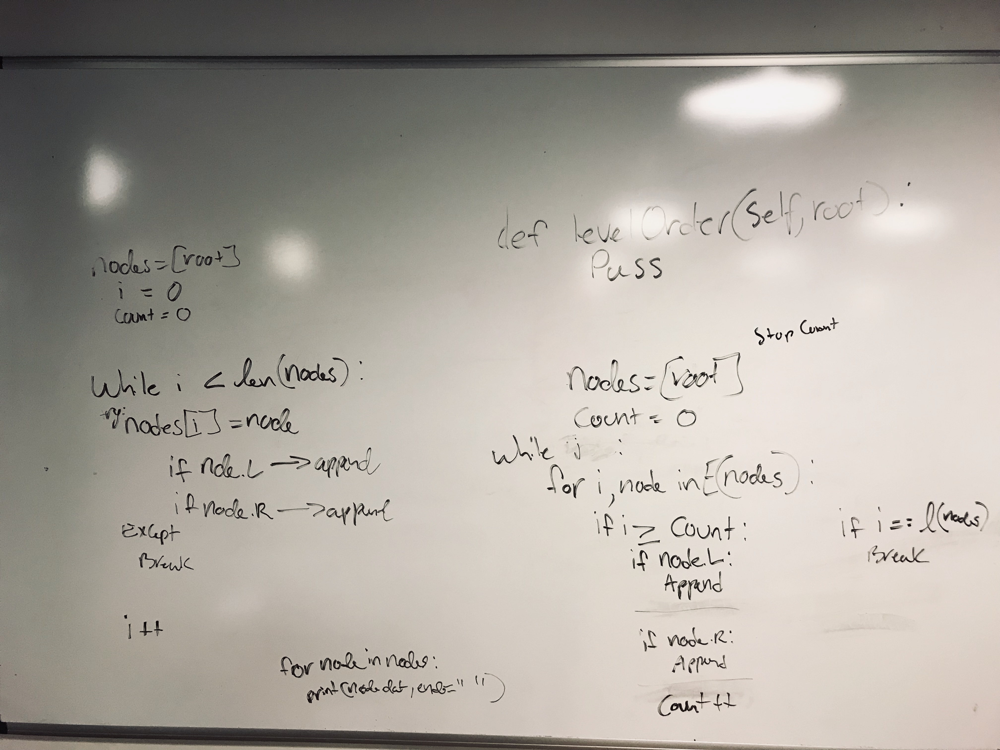

# Python Binary Search Tree Level Order

#### [HackerRank](www.hackerrank.com)

> A level-order traversal, also known
> as a breadth-first search, visits each
> level of a tree's nodes from left to right,
> top to bottom. You are given a pointer, root,
> pointing to the root of a binary search tree.
> Complete the levelOrder function provided in
> your editor so that it prints the level-order
> traversal of the binary search tree.
> Hint: You'll find a queue helpful in completing this challenge.

## Prework

Honestly this one had me stumped for awhile. This is what I started off with.
My final solution came from the second image; the code all the way to the right.




It was actually very simple but I was thinking about it too much.
At first I instantly wanted to do recursion but quickly found out
that, that was the wrong answer simply because I needed to print,
not return anything.

That means either a for loop or a while loop. I had trouble at first thinking
about how to go about it. Until I realized I was trying to do too much at one time.
I wanted to go through each node and child node while printing out the data for each one.

Once I figured out that I need to first add all the nodes in the right order then print them out,
it became easier.

Still, I tried a for loop inside a while loop (never can start off easy, huh?), realized that was wrong,
and switched to my final solution of a simple while loop, while (no pun intended) keeping track of the index.
Obviously should not use a for loop when I am adding to the list that I am trying to loop over.

I love 'try and except' but I did not think about them at first during this. Probably still dazed from trying
to do extra work.

Here we go.

## Code

```python
def levelOrder(self,root):
  #Write your code here
  
  # Decalre all the nodes (root for now) and index starting
  nodes = [root]
  i = 0
  
  # Time to loop, normally this is not a good idea but I am using a try/except
  while True:
    # This try/except will alow us to break the while loop if no more nodes to add
    # because it will be index out of bounds
    try:
    
      # Load the first node since no for loop    
      node = nodes[i]
      
      # Load up the nodes with the children if any
      if node.left: nodes.append(node.left)
      if node.right: nodes.append(node.right)
      
      # Make sure to keep count of where we are
      i += 1
    except:
      break
  
  # Out of the while loop time to do the actual problem and print each data
  for n in nodes:
    print(n.data, end=" ")
```

## Conclusion

Definitely made it harder than it needed to be. But that is a lesson in itself. Multiple lessons learned, check.
